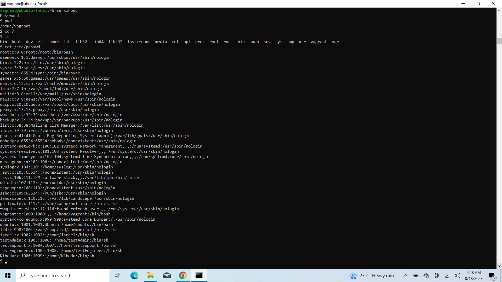

# User and Group Modification Assigment

### Create a User

To create a user, the below linux command is used:
```
1. useradd username
2. cat /etc/passwd | grep username //to confirm creation of user - case sensitive
```
<span style="color: #fe5d00">username -</span> Kihodu

``Snapshot of Code execution in Terminal``


***

### Set User expiry date

Input command

Note: User created above - <span style="color: #fe5d00">Kihodu</span>; will be used in other tasks.
```
1. usermod -e 2023-08-30 Kihodu    //date format - YYYY-MM-DD
2. chage -l Kihodu //shows details about a user; confirmation of first line.
```

``Snapshot of Code execution in Terminal``


***

### Prompt User to change password in next login

Input command

```
1. passwd --expire Kihodu
2. chage -l Kihodu //shows details about a user; confirmation of first line
```

``Snapshot of Code execution in Terminal``


***

### Add a User to a group called AltSchool

Input command

```
1. groupadd groupname   //creates group;
2. cat /etc/group | grep groupname  //to confirm creation of group - AltSchool

1. usermod -a -G groupname username //to add user to a group
2. groups username  //shows groups that a user belongs to
```
groupname - <span style='color:purple'>AltSchool</span>

``Snapshot of Code execution in Terminal``


***

### AltSchool Group can only run cat Command in /etc/

Input command

```
1. chgrp -R AltSchool /etc   //change groupowner for a folder and files in it to AltSchool
2. ls -lah  //shows items in directory with permission and owners
3. chmod -R go-w /etc/  //change permission for others and groupowner - AltSchool; removed the write only
4. chmod o-x /etc/  //remove execute permission for others
5. su Kihodu //switch user to Kihodu to test
6. cd / //change to root directory
7. cat /etc/passwd
```

``Snapshot of Code execution in Terminal``




***

### Create User that doesnt have a home directory

Input command

```
1. useradd -M username //username - testUser
2. chage -l username //shows details about a user; confirmation of first line
```

``Snapshot of Code execution in Terminal``


***